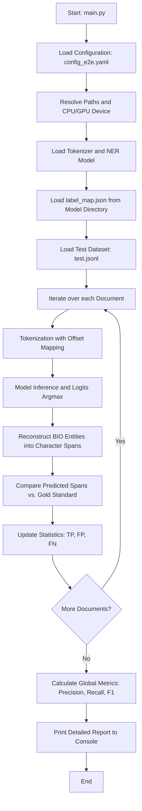

# Named Entity Recognition (NER) Evaluation Pipeline

This directory contains the code and configuration for the end-to-end evaluation of the Named Entity Recognition (NER) model. Its primary objective is to measure the accuracy of the token classification model in identifying clinical text spans and categorizing them, comparing predictions against a reference annotated dataset (Gold Standard).

---

## Pipeline Architecture

The execution flow of the `src_e2e` module is described in the following flowchart:



---

## Components and Detailed Logic

### 1. Configuration Loading (`load_config`)
The script reads settings from a YAML file (`config/config_e2e.yaml`). It dynamically resolves relative paths specified in the configuration file into absolute paths based on the project root directory or a parameterized base directory.

### 2. Model Preparation and Inference
- **Component Loading**: Uses the Hugging Face `transformers` library to load the model weights (`AutoModelForTokenClassification`) and its corresponding tokenizer (`AutoTokenizer`).
- **Label Mapping**: Reads the `label_map.json` file located in the model directory. This file maps the numerical output indices of the classifier to their corresponding text labels following the BIO format (e.g., `B-ENFERMEDAD`, `I-ENFERMEDAD`, `O`).
- **Inference**: The input text is processed by the model in evaluation mode (`model.eval()`) under a context that disables gradient computation (`torch.no_grad()`).

### 3. Entity Reconstruction from BIO Format (`get_entities_from_bio`)
Since the model classifies individual tokens, it is necessary to reconstruct the character boundaries (spans) of the entities from the predicted sequence of BIO labels:
- **Offset Mapping**: The tokenizer returns the `offset_mapping` property, which indicates the start and end index of each token in the original text string.
- **Merging Algorithm**: 
  - Upon encountering a label starting with `B-` (Begin), a new entity is initialized, recording the label type, the token start index (adjusting for leading whitespaces), and the end index.
  - If the subsequent token has an `I-` (Inside) label matching the type of the current entity, the end index of the entity is extended to the boundary of this token.
  - Upon encountering an `O` (Outside) label or a different label type, the current entity is saved and the accumulation is closed.

### 4. Span Evaluation and Metrics
The pipeline performs an entity-level evaluation based on exact boundaries (exact span matching). For each document, it compares the list of predicted entities against the Gold Standard annotations:
- **True Positive (TP)**: The predicted entity exactly matches the position (`start` and `end`) and label type (`label`) of a Gold entity.
- **False Positive (FP)**: The predicted entity does not exist in the Gold annotations.
- **False Negative (FN)**: A Gold entity was not identified by the model.

Using these accumulators, global performance metrics are calculated:

$$\text{Precision} = \frac{TP}{TP + FP}$$

$$\text{Recall} = \frac{TP}{TP + FN}$$

$$\text{F1-Score} = 2 \cdot \frac{\text{Precision} \cdot \text{Recall}}{\text{Precision} + \text{Recall}}$$

---

## Module File Structure

*   **[main.py](main.py)**: Main script that orchestrates data loading, initializes models, performs inference, implements the BIO reconstruction algorithm, and computes and reports performance metrics.

---

## Configuration and Execution

### Configuration File (`config/config_e2e.yaml`)
Defines the paths to the NER model and the test dataset, as well as inference parameters:
```yaml
paths:
  ner_model:   "../models/MrBERT-es-ner_model_multiclass_ampere-8192_length"
  input_jsonl: "../data/test.jsonl"

inference:
  batch_size_ner: 32
  max_length: 8192

misc:
  device: "auto"
```

### Execution Command
To run the evaluation from the project root, execute the following command in your terminal:

```bash
python src_e2e/main.py --config config/config_e2e.yaml
```

The script will print a detailed trace to the console for each document in the dataset, indicating matches (`✔️ OK`), false positives (`❌ FP`), and misses (`⚠️ MISS`), followed by a summary table with the calculated global metrics.
