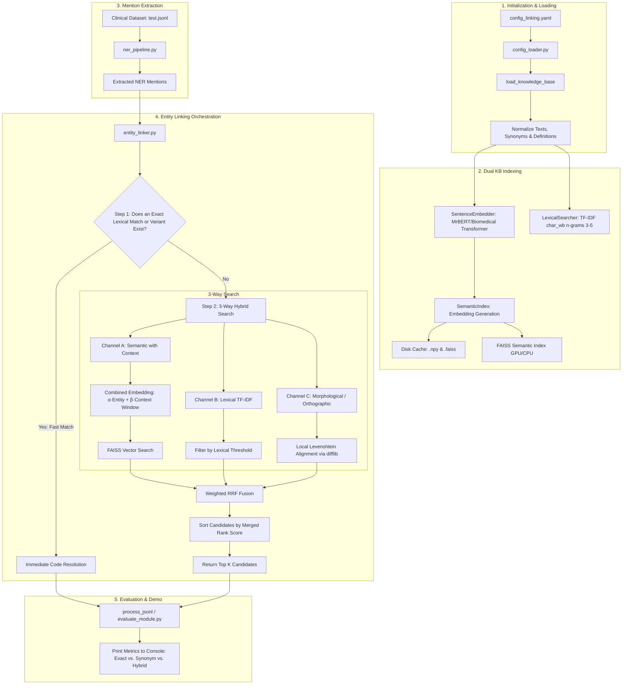

# Hybrid Entity Linking Pipeline with Reciprocal Rank Fusion (RRF)

This directory contains the implementation of an advanced **3-Way Hybrid Entity Linking (EL)** system designed to resolve clinical mentions extracted from medical texts and link them to standardized concepts in a Knowledge Base (KB), such as SNOMED CT. The system combines dense neural retrieval, lexical matching via character n-grams, and local orthographic alignment, merging their rankings using Reciprocal Rank Fusion (RRF).

---

## System Architecture

The Entity Linking pipeline processes information across multiple sequential and parallel layers to optimize both speed and accuracy in concept resolution:



---

## Components and Detailed Logic

### 1. Knowledge Base Loading and Normalization (`entity_linker.py`)
The knowledge base is read from a CSV file (e.g., `snomed_enriched.csv`).
- **Text Normalization**: All medical texts are normalized by removing diacritics (accents), converting to lowercase, and stripping unnecessary spaces using the `text_processing.py` module.
- **Search Field Enrichment**: A unified `search_text` column is constructed by concatenating the main term, the clinical definition generated by Large Language Models (LLMs), and concept synonyms separated by pipes (`|`).

### 2. Dual Indexing (`semantic_index.py` & `lexical_search.py`)
- **Semantic Index**: Uses `SentenceEmbedder` to encode the `search_text` field into dense vectors. It implements **Mean Pooling** over the final hidden states of the language model. If supported by the hardware, it performs inference using 16-bit floating-point precision (`bfloat16`) on GPU. To avoid recalculating embeddings, it serializes them to a local disk cache in NumPy format (`.npy`) and the index in FAISS format (`.faiss`).
- **Lexical Index**: Trains a `TfidfVectorizer` model parameterized to analyze word-level character n-grams (`char_wb`, from 3 to 5 characters). This provides robustness against typos, prefix/suffix variations, and abbreviations.

### 3. First-Pass Fast Lexical Filter (`lexical_match`)
Before starting expensive vector and neural searches, the system attempts to resolve the entity through exact matching:
1.  **Exact Match**: Checks if the normalized text of the mention matches exactly with the normalized term of any concept in the KB.
2.  **Synonym Match**: Looks for exact matches with loaded synonyms.
3.  **Morphological Candidates**: If there is no hit, it expands the mention into multiple morphological variations of gender, number, and clinical suffixes (e.g., plurals with `-es` / `-s`, gender with `-o` / `-a`, and suffixes like `-al` / `-ales`) using the `singular_candidates` algorithm, testing exact matches again.
4.  If a match is found, it returns the concept immediately with a maximum confidence score ($1.0, 0.99 \text{ or } 0.98$), bypassing the GPU call.

### 4. 3-Way Hybrid Search and Reciprocal Rank Fusion (RRF)
When the first pass does not produce results, the concurrent hybrid search is activated:
-   **Channel A (Semantic with Context)**: Generates an embedding for the entity mention ($\vec{e}$) and another for the character context window surrounding it in the original text ($\vec{c}$). It computes a unified representation:
    $$\vec{q}_{\text{combined}} = \alpha \cdot \vec{e} + \beta \cdot \vec{c}$$
    *Where $\alpha$ is the entity weight (typically 0.9) and $\beta$ is the context weight (typically 0.1).*
    It searches for the nearest neighbors in the FAISS index and filters out candidates that do not meet the minimum cosine similarity threshold (`semantic_threshold`).
-   **Channel B (Lexical TF-IDF)**: Retrieves candidates with the highest character n-gram orthographic similarity using the TF-IDF vectorizer and filters by a lexical threshold (`lexical_threshold`).
-   **Channel C (Local Levenshtein/Morphological)**: For all candidates preselected by channels A and B, it computes the edit distance (local Levenshtein) using `difflib.SequenceMatcher` between the mention and the KB term or its synonyms.

#### Weighted RRF Fusion
The candidate rankings returned by each channel are fused to generate a single relevance order. For each candidate with index $i$ in the KB, its final RRF score is calculated as:

$$\text{RRF Score}(i) = \sum_{\text{channel} \in \{\text{Sem}, \text{Lex}, \text{Morph}\}} \frac{w_{\text{channel}}}{k + \text{Rank}_{\text{channel}}(i)}$$

*   $k$ is a smoothing factor that prevents top ranks from disproportionately dominating the score (by default, $k = 60$).
*   $w_{\text{Sem}} = 1.0$ and $w_{\text{Lex}} = 1.0$.
*   $w_{\text{Morph}}$ is dynamically weighted: if the Levenshtein similarity is very high ($\ge 0.8$), it is assigned a weight of $2.0$ to favor exact orthographic matches over abstract semantic meaning; otherwise, it takes a weight of $1.0$.

The candidate with the highest accumulated RRF score is selected as the optimal link.

---

## Source Code Mapping

Below is the responsibility of each file within the module:

| File | Responsibility |
| :--- | :--- |
| **[main.py](main.py)** | Entry point of the pipeline. Orchestrates index initialization, NER model loading, and execution in evaluation or demo mode. |
| **[config_loader.py](config_loader.py)** | Loads and validates the YAML configuration file, managing absolute paths and automatic hardware detection (CUDA/CPU). |
| **[text_processing.py](text_processing.py)** | Provides string normalization, accent removal, context window extraction, and dataset annotation parsing utilities. |
| **[ner_pipeline.py](ner_pipeline.py)** | Encapsulates the Hugging Face clinical named entity extraction pipeline. |
| **[lexical_search.py](lexical_search.py)** | Implements the fast exact classifier logic (`lexical_match`) and the lexical searcher based on character n-gram TF-IDF similarity. |
| **[semantic_index.py](semantic_index.py)** | Manages dense neural encoding (`SentenceEmbedder`), FAISS GPU/CPU index construction, and the index persistent caching strategy. |
| **[hybrid_searcher.py](hybrid_searcher.py)** | Implements the hybrid search orchestrator and applies the weighted RRF fusion mathematical algorithm. |
| **[entity_linker.py](entity_linker.py)** | Manages the entity-level linking lifecycle. Coordinates sequential execution (Lexical Match $\rightarrow$ Hybrid Match) and normalizes KB DataFrame records. |
| **[evaluate_module.py](evaluate_module.py)** | Implements classes and iterators to process JSONL datasets, classify links into categories (exact, synonym, hybrid), and compute the final accuracy matrix. Contains the function for the interactive demo mode. |
| **[evaluate.py](evaluate.py)** | Auxiliary evaluation script dedicated exclusively to validating the NER extraction phase of the model (isolated from the linking phase). |

---

## Key Configuration (`config/config_linking.yaml`)

The behavior of the hybrid pipeline is adjusted through the following critical parameters:

```yaml
paths:
  ner_model:    "./models/MrBERT-es-ner_model_entity_ampere-8192_length"
  embed_model:  "./models/MrBERT-es-ner_model_entity_ampere-8192_length"
  kb_csv:       "./data/snomed_enriched.csv"
  input_jsonl:  "./data/test.jsonl"
  embeddings_cache: "./embedding_cache_desc"
  index_name: "snomed_hybrid_v1"

search:
  top_k: 5                   # Maximum number of candidates to return
  semantic_threshold: 0.75   # Minimum cosine similarity required in FAISS
  context_alpha: 0.9         # Weight assigned to the entity vector
  context_beta: 0.1          # Weight assigned to the surrounding context vector
  context_window: 256        # Characters extracted on each side of the entity for context
  lexical_threshold: 0.10    # Cosine similarity threshold for TF-IDF
  rrf_k: 60                  # Smoothing constant in the RRF formula
  hybrid_pool_factor: 10     # Candidate retrieval multiplier per channel (top_k * factor)
```

---

## Execution and Testing

### Evaluation Mode (Default)
Processes a clinical test JSONL dataset and generates comprehensive performance statistics detailing accuracy by resolution type (Exact vs. Synonym vs. Hybrid RRF):

```bash
python src_linking/main.py --config config/config_linking.yaml
```

The script will report:
1.  **NER Span Accuracy**: Exact match of localized entities compared to the Gold Standard.
2.  **End-to-End Linking Accuracy**: Percentage of dataset entities that were correctly extracted and linked to the expected SNOMED CT code.
3.  **Conditioned Linking Accuracy**: Accuracy of the linker assuming the NER span was correctly extracted.
4.  **Linking Examples**: Comprehensive tables of matches, failures, and false positives grouped by resolution method.

### Interactive Demo Mode
If `misc.demo: true` is set in the configuration YAML, the pipeline ignores the test dataset and processes the text parameterized in `misc.demo_text`, printing a graphical visualization of the extracted entities and a breakdown of the top 5 SNOMED CT candidates with their individual RRF scores and source channels to the console.
